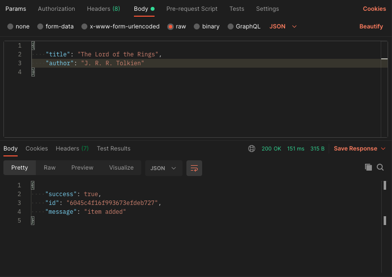
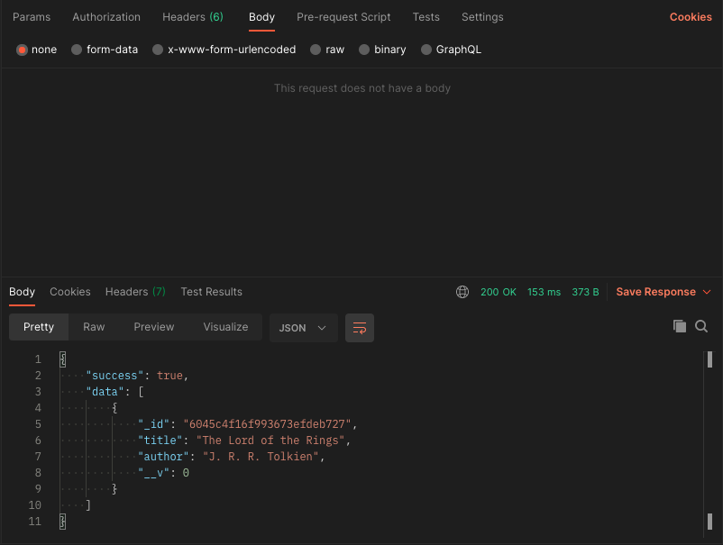
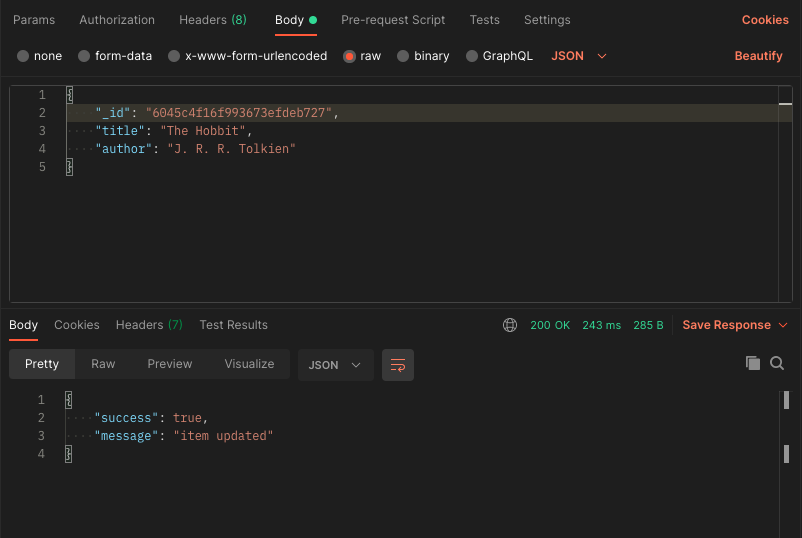
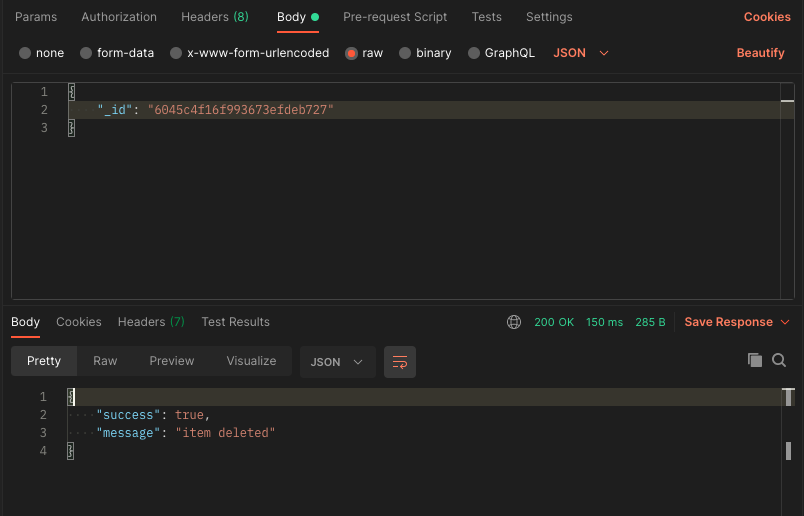

## The Model File

All we are doing on the model file is declaring the schema.
i'm storing books as an example 
if you want to use something else other than books you will have to change all of the variables referencing books.

## The Controller File

This is the file that we declare all of the functions 

<ul> Functions 
  <li> createItem: creates and saves an item with the body data </li>
  <li> getItems: finds all of the items then returns with the data </li>
  <li> deleteItem: finds and deletes one item with the id equal to the body id </li>
  <li> updateItem: finds and updates one item with the body data where the id is equal to the body id </li>
</ul>

There is also some error checking along with each function

Then we finish this page off by exporting all of the functions so we can them on other pages

## The Router File

Here we just set each operation with a function and a route then export it

## The index file

This file we require all of the modules and the router.

Then we create our database connection 
Note: You will have to use your own mongodb credentials

Then Finally start the server on port 3001

## Testing

Once the server is online we can start testing using postman

Your tests should look similar to the following screenshots

#### Post Request

#### Get Request

#### Put Request

#### Delete Request

